# Continous Integration

1. Create an EC2 instance each for jenkins and sonarqube server.

2. SSH into jenkins server, install docker engine(check documentation) and awscli, and add jenkins user to docker group

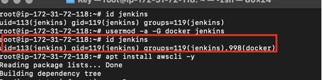

3. Create IAM User with `AmazonEC2ContainerRegistryFullAccess` and `AmazonECS_FullAccess` policies

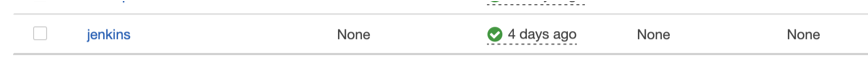

4. Create an ECR reposiory

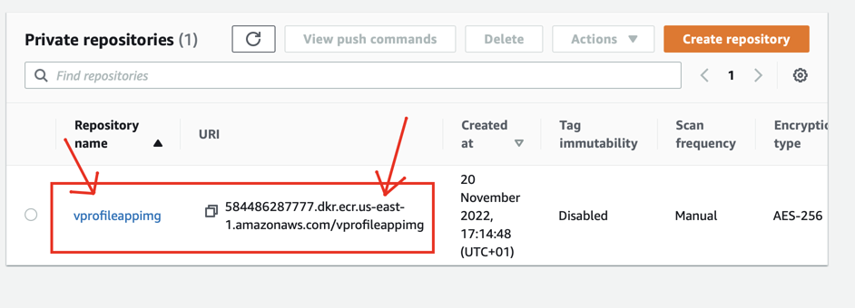

5. Login into jenkins on the browser and install plugins
* Sonarqube Scanner
* pipeline utility steps
* pipeline maven integration
* Docker pipeline
* Amazon ECR
* AWS SDK: All
* cloudBees Docker Build and Publish
* pipeline:aws steps

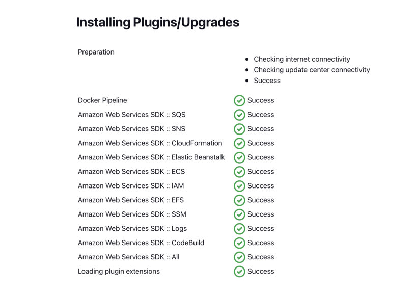

6. Store AWS Credentials(IAM user creds) in jenkins

Dashboard > Manage Jenkins > Manage Credentials > System > Global Credentials > Add Credentials

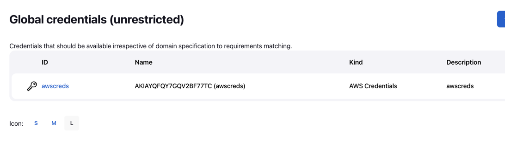

7. Run the pipeline script tp upload image in ECR

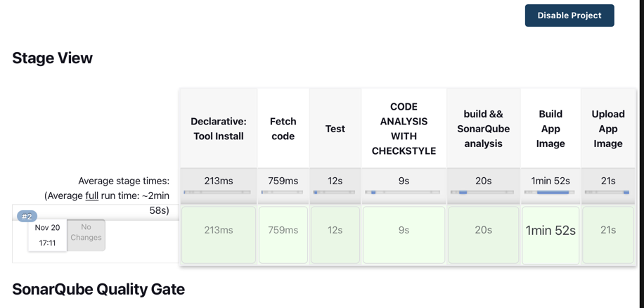

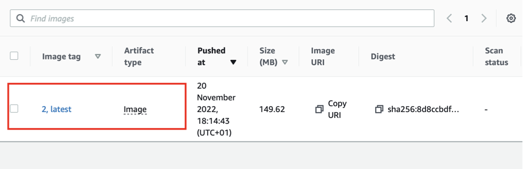

# Continuous Deployment/Delivery: Hosting our dockerized(containerized) application on Amazon ECS

1. Create a cluster in ECS (Use default options)

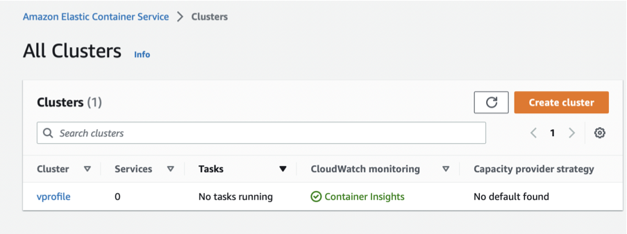

2. Create Task Definition
* Task definitions > create Task
  * Note: Container port is 8080, because the app is running on tomcat server

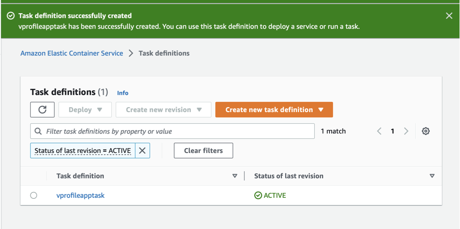

3. Create a Service. Task Definition is used in creating a task in the service
  * Note: When creating the service, an application load balancer(optional) was created. Also, security group was created for the load balancer

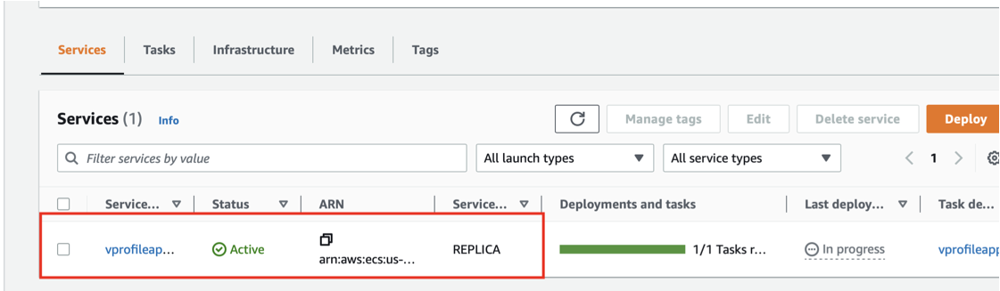

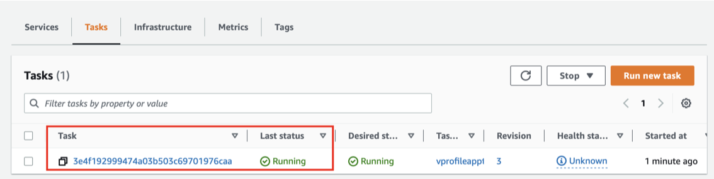

4. Change the Health check port to listen on port 8080
* EC2 > target groups > Health check > Override
  * Note: if the port is not updated, ECS will keep deleting the task and creating another in a loop.

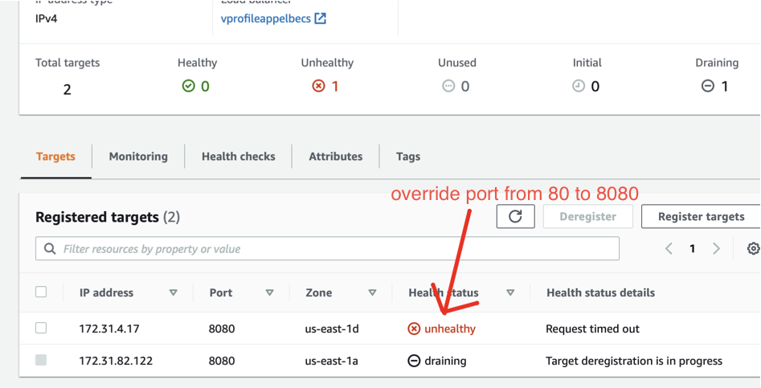

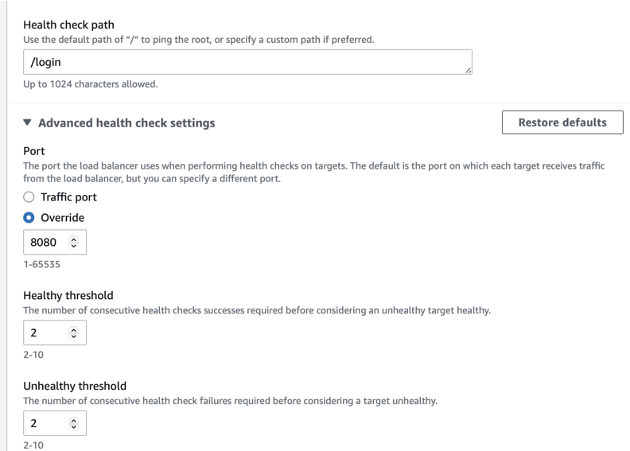

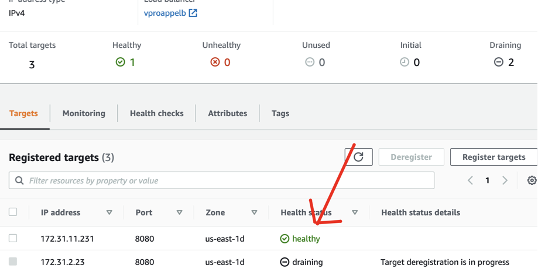

5. Update the load balancer security group to allow inbound traffic from anywhere on port 8080

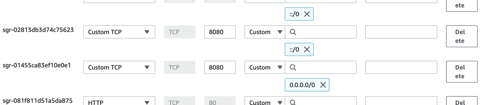

6. Access the application on the browser via load balancer
* ECS > cluster > service > Networking > ELB-DNS-name

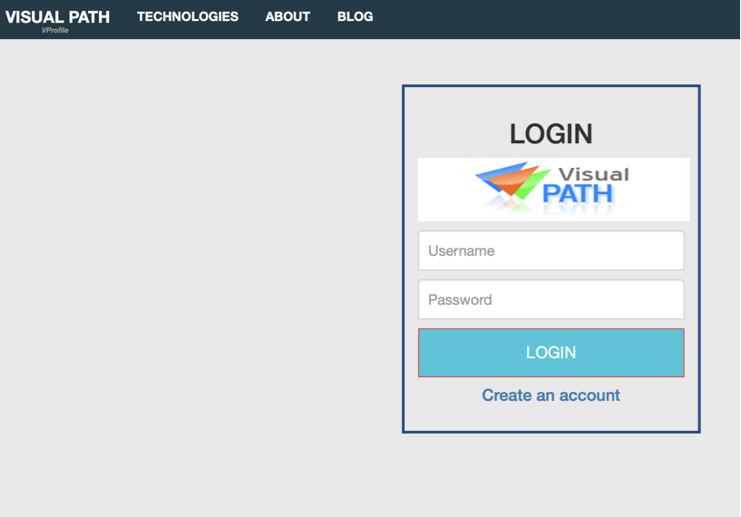

7. Run the pipeline script to deploy to ECS
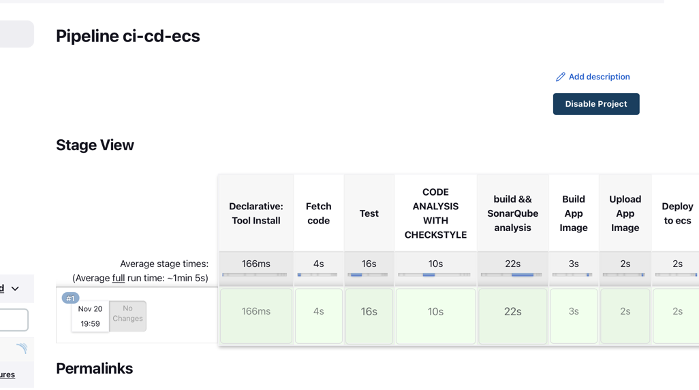

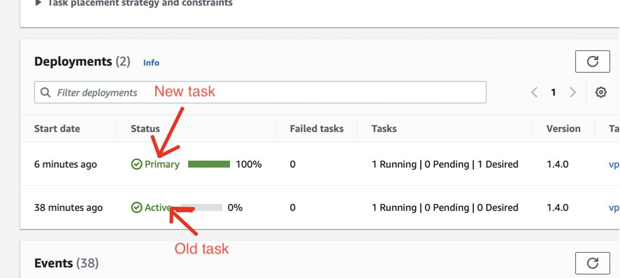

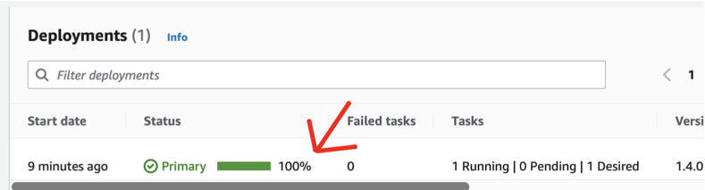